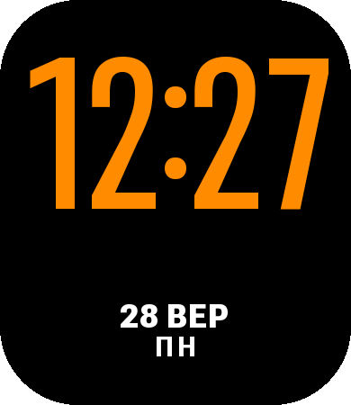

# Orange Time — циферблат для Amazfit Bip 6

Великий помаранчевий час. Нижче білим — число й місяць, під ними день тижня. На активному екрані й в AOD вигляд однаковий.



## Встановлення

1. У Zepp увімкни режим розробника: Профіль → Налаштування → «Детально» (Про застосунок) → 7 разів поспіль натисни на іконку Zepp.
2. Пристрій → Amazfit Bip 6 → «Загальні» або самий низ сторінки → «Режим розробника» → кнопка сканування QR у правому верхньому куті.
3. Відскануй QR-код (показати його можна з іншого екрана):

   

   Посилання в QR-коді: `watchface://raw.githubusercontent.com/netherm3-coder/bip6-watchface/build/orange-time.zpk` (схема `watchface://` — для циферблатів; `zpkd1://` Zepp приймає лише для міні-застосунків)
4. На годиннику відкрий Налаштування → Дисплей → Завжди увімкнений екран і вибери стиль, що бере вигляд із циферблата.

## Як це збирається

Після кожного пушу в `main` GitHub Actions запускає `zeus build` і кладе готовий пакет у гілку `build`:

- `orange-time.zpk` — пакет для Bip 6, на нього вказує QR-код;
- `orange-time.zab` — повний пакет збірки.

Збірку можна запустити й вручну: Actions → Build watch face → Run workflow.

## Як змінити вигляд

Колір, розміри й відступи задаються на початку `tools/gen_assets.py`. Після змін:

```bash
pip install pillow fonttools
python3 tools/gen_assets.py
```

Скрипт перемалює картинки в `assets/bip6/`, оновить координати у `watchface/index.js` і прев'ю в `docs/preview.png`. Далі комітиш зміни, а GitHub збирає новий пакет.

## Технічні нотатки

- Zepp OS 5 (API 3.0+), цілі збірки — лише Bip 6 (`deviceSource` 9765120, 9765121, 10158337), дизайн 390×450.
- Час, дату й день тижня малюють системні віджети `IMG_TIME`, `IMG_DATE`, `IMG_WEEK`, які прошивка оновлює і в AOD. Якщо якогось віджета немає, той елемент малюється картинками з оновленням щохвилини з JS.
- Формат часу 24-годинний. У 12-годинному режимі телефона годинник показуватиме години без AM/PM.
- Шрифт — [Roboto Flex](https://fonts.google.com/specimen/Roboto+Flex) (SIL Open Font License 1.1). У репозиторії лише згенеровані з нього картинки.
